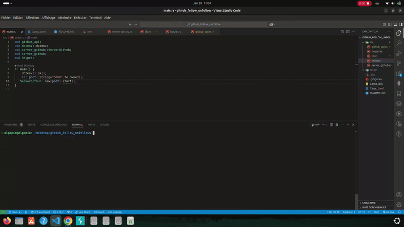

# Unfollow Non-Followers


A Rust-based tool to identify and unfollow GitHub users who don’t follow you back. This project leverages the GitHub API to streamline your follow list and manage your connections effectively.

---

## Features

- Automatically identifies GitHub users you follow who don’t follow you back.
- Provides a web page interface to select specific users to unfollow.
- Unfollows non-followers using a simple and secure process.
- Token-based authentication with GitHub API for privacy and security.

---

## Installation

### Prerequisites

1. **Rust**: Ensure Rust is installed. If not, install it via [Rustup](https://rustup.rs/).
2. **GitHub Token**: Generate a personal access token from your GitHub account:
   - Go to [GitHub Token Settings](https://github.com/settings/tokens).
   - Click **Generate new token** and select appropriate permissions (`read:user`, `user:follow`).
3. **Git**: Install Git to clone the repository.

---

### Steps to Install

1. Clone the repository:

   ```bash
   git clone https://github.com/alpapie/unfollow-non-followers-github.git
   cd unfollow-non-followers
   ```

2. Create an `.env` file in the root directory and add your GitHub token:

   ```plaintext
   TOKEN=your_personal_access_token
   ```

3. Build the project:

   ```bash
   cargo build --release
   ```

4. Run the tool:

   ```bash
   cargo run
   ```

5. Access the web interface:
   - Open your browser and navigate to the provided local URL (e.g., `http://localhost:5000`).
   - Use the interface to view and select users to unfollow.

---

## Usage

1. The tool will connect to GitHub using the token provided in the `.env` file.
2. It retrieves:
   - The list of users you follow.
   - The list of users who follow you.
3. Alternatively, use the web interface to manually select users to unfollow.
4. Identifies non-followers and unfollows them upon confirmation.

---

## Contributing

We welcome contributions to improve this tool! Here's how you can get involved:

1. **Fork the Repository**:

   - Click the "Fork" button on the top-right of this page.

2. **Clone Your Fork**:

   ```bash
   git clone https://github.com/alpapie/unfollow-non-followers.git
   cd unfollow-non-followers
   ```

3. **Create a Branch**:

   ```bash
   git checkout -b feature/your-feature-name
   ```

4. **Make Your Changes**:

   - Ensure your code follows Rust best practices.

5. **Submit a Pull Request**:

   - Push your changes:
     ```bash
     git push origin feature/your-feature-name
     ```
   - Create a Pull Request on GitHub.

---

## Requirements

- **Rust (1.65+)**: For building and running the project.
- **GitHub Token**: Required for authenticating with the GitHub API.

---

If you find this tool helpful, give it a ⭐️ and share it with others! 😊

